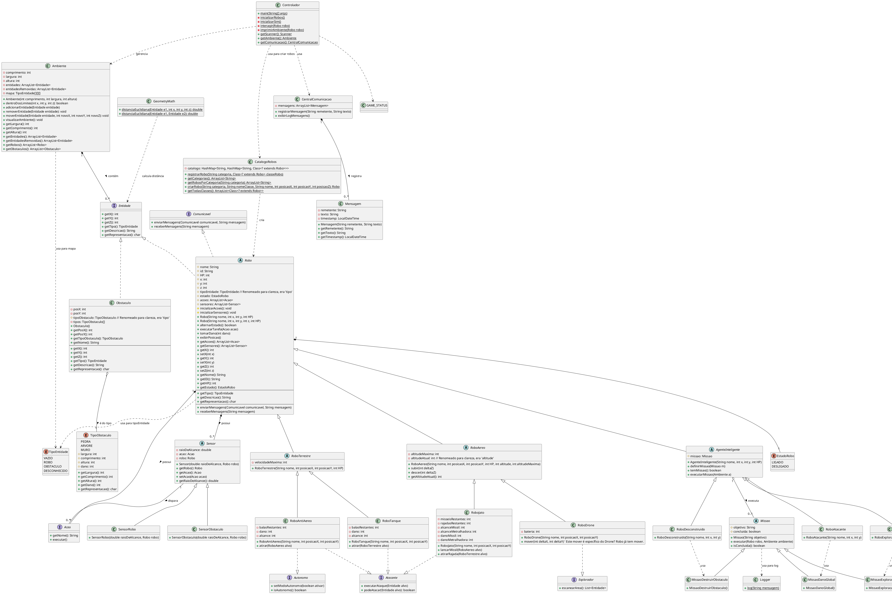

# Simulador de robôs - Repositório de Labs

Este repositório contém os códigos desenvolvidos durante os laboratórios da disciplina **MC322 - Programação Orientada a Objetos**. 

### Diagrama UML do simulador

## Estrutura do Repositório

Os códigos estão organizados em pastas, onde cada pasta corresponde a um laboratório específico. O nome de cada pasta indica o laboratório específico.

A ideia é que seja possível analisar a evolução do sistema de simulação a cada laboratório.

## Como Navegar

1. Explore as pastas para encontrar o código relacionado a cada laboratório.
2. Cada pasta contém arquivos de código-fonte, testes e outros recursos utilizados no laboratório, além de um README.md indicando os recursos novos implementados e outros detalhes.

## Como executar

Cada laboratório contém, em sua pasta, um REAME.md que indica com mais detalhes como executar o simulador no estágio em que se encontra. 
Nele estarão instruções de execução e de interação com o simulador.

## IDEs utilizadas no desenvolvimento do simulador

- Visual Studio Code (Miguel)
- IntelliJ (Rafael)

### Versão utilizada do Jav

openjdk version "24.0.1"

## Contribuidores
- **Miguel** (_281335_)
- **Rafael** (_281359_) 